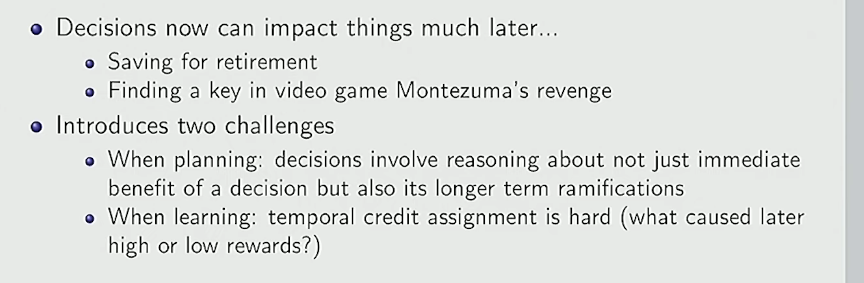
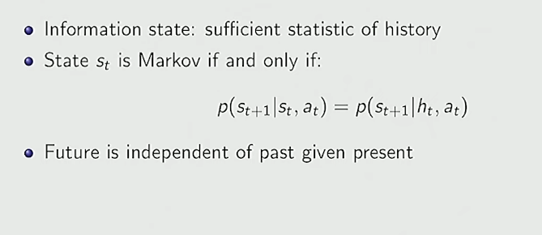
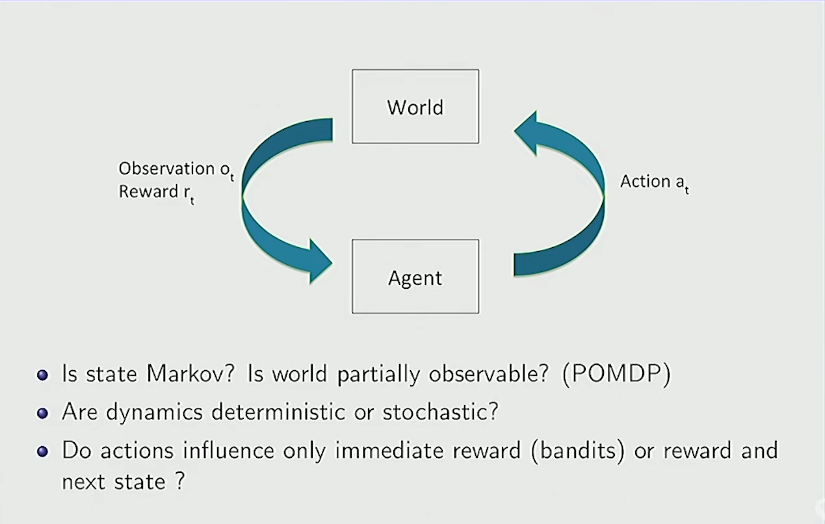
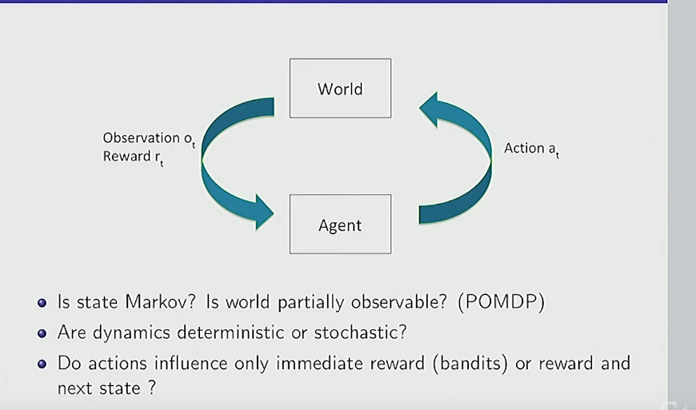

Planning (Planlama):

Bir kararın sadece anlık getirisi değil, uzun vadeli etkileri de var.

Örneğin: “Şimdi tatlı yemek mi, yoksa diyet mi yapmak?” → kısa vadede tatlı iyi hissettirir ama uzun vadede sağlığa zararlı.

Learning (Öğrenme):

Temporal Credit Assignment Problem: Hangi geçmiş kararım bugünkü ödülü getirdi?

Örneğin: 100 adım önce aldığın anahtar yüzünden bugün kazandın. Ama algoritma nasıl bilecek ki bu kadar eski bir aksiyonun bu sonucu doğurduğunu?

Bu RL’in en temel teknik zorluklarından biridir.

# Markov Assumption

Bazı durumlarda Markov varsayımı doğru değildir.

Örn: Bir öğrencinin performansı → sadece bugünkü bilgi değil, önceki deneyimlere de bağlı olabilir.

Böyle durumlarda POMDP (Partially Observable Markov Decision Process) kullanılır.

🎯 Özet

Markov varsayımı RL’in temel taşı.

Çünkü bu sayede matematiksel olarak MDP (Markov Decision Process) tanımı yapılabiliyor.

Ajan: “Sadece bugünkü state’i bilsem yeter” diye düşünür.

