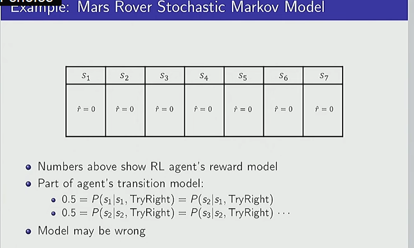
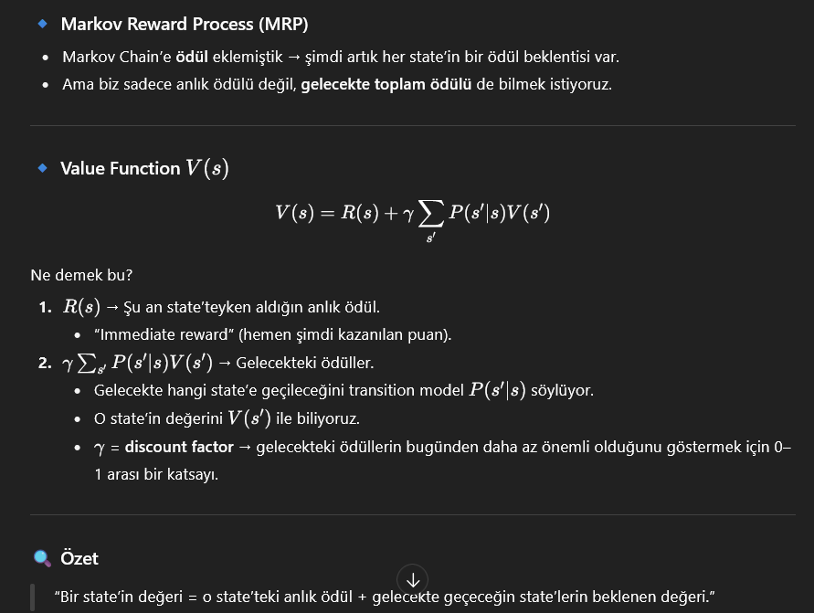
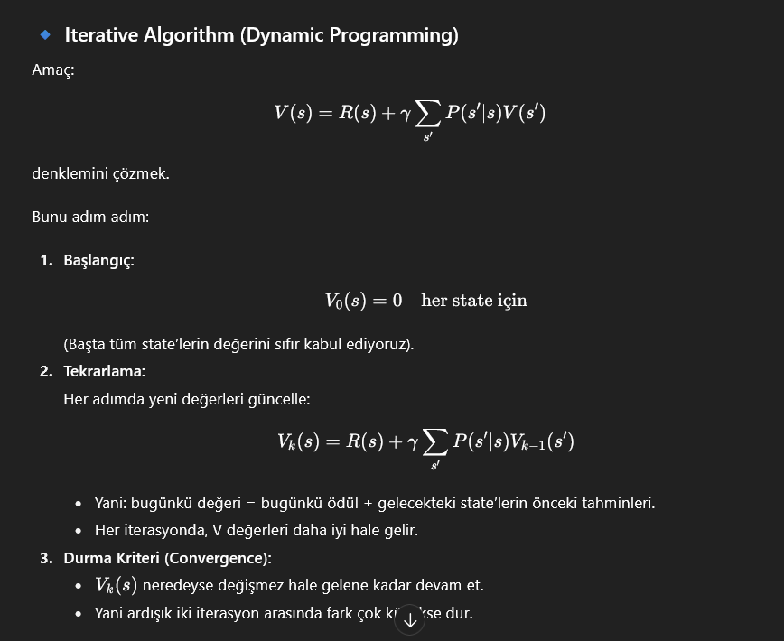

Planning (Planlama):

Bir kararın sadece anlık getirisi değil, uzun vadeli etkileri de var.

Örneğin: “Şimdi tatlı yemek mi, yoksa diyet mi yapmak?” → kısa vadede tatlı iyi hissettirir ama uzun vadede sağlığa zararlı.

Learning (Öğrenme):

Temporal Credit Assignment Problem: Hangi geçmiş kararım bugünkü ödülü getirdi?

Örneğin: 100 adım önce aldığın anahtar yüzünden bugün kazandın. Ama algoritma nasıl bilecek ki bu kadar eski bir aksiyonun bu sonucu doğurduğunu?

Bu RL’in en temel teknik zorluklarından biridir.

# Markov Assumption

Bazı durumlarda Markov varsayımı doğru değildir.

Örn: Bir öğrencinin performansı → sadece bugünkü bilgi değil, önceki deneyimlere de bağlı olabilir.

Böyle durumlarda POMDP (Partially Observable Markov Decision Process) kullanılır.

🎯 Özet

Markov varsayımı RL’in temel taşı.

Çünkü bu sayede matematiksel olarak MDP (Markov Decision Process) tanımı yapılabiliyor.

Ajan: “Sadece bugünkü state’i bilsem yeter” diye düşünür.

🔹 Transition Model (Geçiş modeli)

Bu şunu söyler:

“Şu an buradaysam ve şunu yaparsam, sonraki durumda nerede olacağım?”

Örn:

Labirent oyunu: Sağ tuşuna bastın → %80 ihtimalle sağa gidersin, %20 ihtimalle kayarsın ve aşağı düşersin.

🔹 Reward Model (Ödül modeli)

Bu şunu söyler:

“Şu an buradayım ve şu aksiyonu yapıyorum → bundan ne kadar puan kazanırım?”

Örn:

Labirent oyunu: Çıkış kapısına ulaşırsan +10 puan, duvara çarparsan −1 puan, boş adımda 0 puan.

Süper, bu slayt RL’de çok kullanılan bir örnek ortamı açıklıyor: Mars Rover problemi. Hadi basitleştirerek parça parça anlatalım:

🚀 Ortam

Rover’ın bulunduğu 7 tane hücre var: 
S1,S2,…,S7
S
1
	​

,S
2
	​

,…,S
7
	​

.

Rover bir aksiyon seçiyor: örneğin “sağa git” (TryRight).

🔹 Reward (ödül)

Yukarıdaki kutuların içinde “
r^=0
r
^
=0” yazıyor.

Yani burada gösterilen tüm state’lerde anlık ödül 0.

(Ama aslında genelde bazı state’lerde ödül olur: mesela çıkışta +10, tehlikede −1).

🔹 Transition Model (Geçiş olasılıkları)

Slaytta verilen örnek:

0.5=P(s1∣s1,TryRight)=P(s2∣s1,TryRight)
0.5=P(s
1
	​

∣s
1
	​

,TryRight)=P(s
2
	​

∣s
1
	​

,TryRight)

Bunun anlamı:

Eğer Rover 
S1
S
1
	​

’deyken “sağa git” dersen, %50 ihtimalle aynı yerde kalıyor (
S1
S
1
	​

)

%50 ihtimalle sağa geçiyor (
S2
S
2
	​

).

Benzer şekilde:

0.5=P(s2∣s2,TryRight)=P(s3∣s2,TryRight)
0.5=P(s
2
	​

∣s
2
	​

,TryRight)=P(s
3
	​

∣s
2
	​

,TryRight)

Yani 
S2
S
2
	​

’deyken sağa git → %50 ihtimalle 
S2
S
2
	​

’de kal, %50 ihtimalle 
S3
S
3
	​

’e geç.

🔹 Önemli Nokta

Bu bir stochastic (olasılıklı) ortam → her aksiyon aynı sonucu vermez.

Ajanın “dünyayı yanlış modelleme” ihtimali var. Yani Rover sanıyor ki hep sağa gidecek, ama aslında yarı yarıya kayıyor.

🧩 Basit benzetme

Düşün: Mars’ta rover kum tepelerinde ilerliyor. “Sağa git” diyorsun → ama zeminin kayganlığından dolayı bazen yerinde sayıyor, bazen gerçekten ilerliyor.

